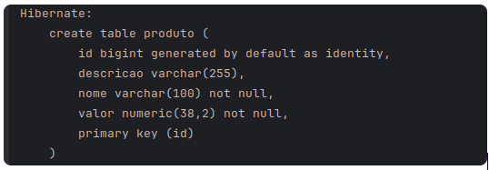

# Módulo de Exercício - EBAC 32

Este projeto faz parte do módulo 32 do curso da EBAC (Escola Britânica de Arte e Computação). O objetivo principal deste módulo foi praticar o uso do **JPA (Java Persistence API)** com **Hibernate**, conectando-se a um banco de dados PostgreSQL e manipulando dados por meio de uma aplicação Java.

## Descrição

O projeto consiste em uma aplicação Java simples que utiliza JPA e Hibernate para gerenciar uma entidade chamada **Produto**. A aplicação se conecta a um banco de dados PostgreSQL, cria a tabela `produto` e insere dados na tabela utilizando o EntityManager.

## Estrutura do Projeto

- **Main.java**: Arquivo principal que contém a lógica para persistir um novo produto no banco de dados.
- **Produto.java**: Classe de entidade que mapeia a tabela `produto` no banco de dados.

## Funcionalidade

A aplicação realiza os seguintes passos:

1. Criação de um novo objeto `Produto`.
2. Configuração de seus atributos (`nome`, `valor`, `descricao`).
3. Persistência do objeto no banco de dados usando JPA e Hibernate.
4. A transação é confirmada e o produto é salvo no banco de dados.

## Dependências

Este projeto utiliza o Maven como ferramenta de gerenciamento de dependências. As dependências principais são:

- **Spring Boot**: Para facilitar a configuração do JPA e o gerenciamento da aplicação.
- **PostgreSQL**: O banco de dados utilizado para armazenar os dados.
- **Hibernate**: O provedor JPA utilizado para persistir as entidades no banco de dados.

